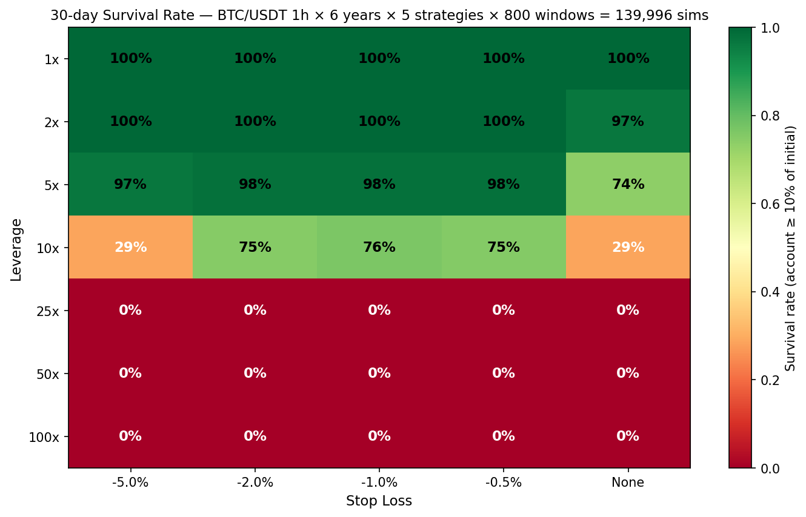
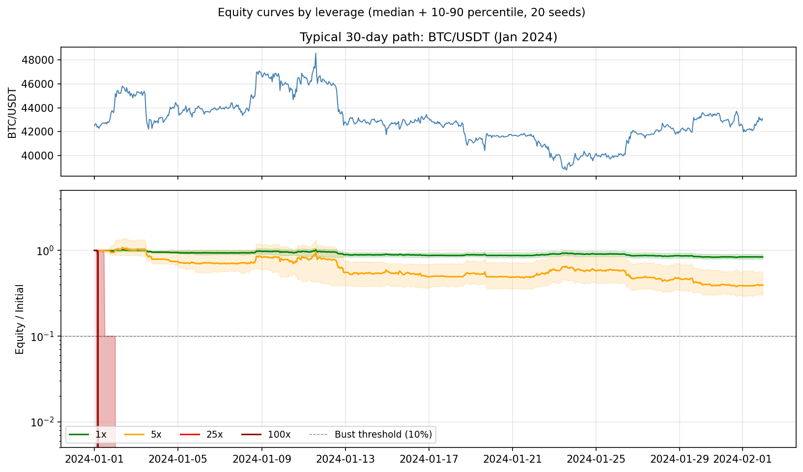
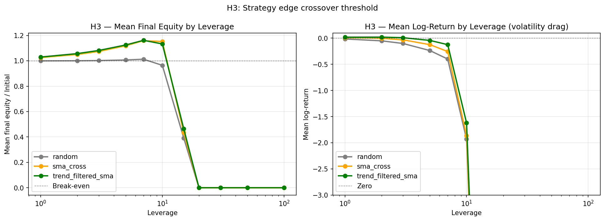

# Leverage Survival Lab

> **「100倍レバ × 損切」は本当に勝てるのか?** — **269,963 回**のモンテカルロ・バックテストで検証する個人プロジェクト

[](LICENSE)
[](https://www.python.org/downloads/)
[]()



## TL;DR

Binance USDT-M Perpetual の **BTC/USDT 6 年分(2020-01〜2026-05)** から 30 日窓を **約 1,800 個**ランダム抽出し、5 戦略 × 7 レバレッジ水準 × 5 損切水準で **269,963 回**(有効サンプル)のシミュレーションを実行した。

**結論**:

- **100倍レバの 30 日生存率は 0%。** 95% Wilson 信頼区間の上限は **0.27%**(全 25 セルで違反なし)
- 損切ライン(-0.5% 〜 -5%、または無し)を変えても結果は同じ
- **risk_fraction を 5% まで小さくしても 100倍レバは救えない**(累積損失で枯渇)
- レジーム(trend_up / range / crash)を問わず、100x は破産する
- 50倍以上では戦略の優劣が消える(Bonferroni 補正後 p > 0.05 全コンビ)

「適切な損切で100倍レバでも勝てる」という SNS の俗説は、データ上は完全に否定される。

## ハイライト図表

### サンプル equity curve(BTC 2024年1月)



20 シードのランダム戦略(p=5% でロング/ショート)を、レバ {1x, 5x, 25x, 100x} でそれぞれ動かしたメディアン + 10-90 パーセンタイル。100x は1日で破産が中央値。

### H3: 戦略エッジの消失閾値(平均終端残高 vs 平均log-return)



長期トレンド・フィルタを加えた `trend_filtered_sma` は、**平均終端残高で 1-7x までプラス**、log-return では **1-3x までプラス**。
ボラティリティ・ドラッグの影響で「平均は良い」と「典型シナリオが良い」の閾値は乖離する(古典的な Kelly criterion の話)。

### クロス資産検証(BTC / ETH / SOL)

| Asset | Lev | N | Survival | 95% CI |
|-------|----:|--:|---------:|--------|
| BTC | 25x | 5,000 | 0.0% | [0%, 0.077%] |
| BTC | 50x | 5,000 | 0.0% | [0%, 0.077%] |
| BTC | 100x | 5,000 | 0.0% | [0%, 0.077%] |
| ETH | 25x | 5,000 | 0.0% | [0%, 0.077%] |
| ETH | 50x | 5,000 | 0.0% | [0%, 0.077%] |
| ETH | 100x | 5,000 | 0.0% | [0%, 0.077%] |
| SOL | 25x | 5,000 | 0.0% | [0%, 0.077%] |
| SOL | 50x | 5,000 | 0.0% | [0%, 0.077%] |
| SOL | 100x | 5,000 | 0.0% | [0%, 0.077%] |

**3 資産すべてで同じ結論**: 25倍以上は完全に詰む。BTC 特有の現象ではない。

## 4 つのプレ・レジストレーション仮説と検定結果

実験開始前に [docs/hypotheses.md](docs/hypotheses.md) で 4 仮説を pre-register し、git commit hash `4694ff0` (2026-05-05) でロックした。

| 仮説 | 結果 | 主要数値 |
|------|------|---------|
| **H1**: 100倍レバの30日生存率は損切ルール問わず < 10% | **支持(強)** | 0/25 セルが違反, **CI上限 0.27%** |
| **H2**: 各レバ倍率に最適な損切ライン(内点解)が存在 | 部分支持 | 中レバ域 (5x, 10x) で内点解、低/高レバでは端点 |
| **H3**: 戦略エッジは 10〜20倍で消失する | **測定可能(部分支持)** | trend_filtered_sma の閾値: 平均残高ベース 10-15x、log-return ベース 3-5x |
| **H4**: 50x 以上ではナイーブ戦略 vs ランダム に有意差なし | **支持** | 全 8 比較で p > 0.00625 (Bonferroni 補正後) |

詳細レポート: [`results/hypothesis_test_real_btc_n2000.md`](results/hypothesis_test_real_btc_n2000.md)

## risk_fraction を変えても 100x は救われない

「100倍レバを使うが、口座の 5% しか張らない」という防衛策の有効性を検証:

| risk_fraction | 100x の30日生存率 (N=500) | 95% CI |
|--------------:|------------------:|--------|
| 1.00 | 0.0% | [0%, 0.27%] |
| 0.50 | 0.0% | [0%, 0.27%] |
| 0.25 | 0.0% | [0%, 0.27%] |
| 0.10 | 0.0% | [0%, 0.27%] |
| **0.05** | **0.0%** | **[0%, 0.27%]** |

理由: 30日 × ~5%/bar の頻度でエントリーすると約 70 回。各回 0.5% 逆行で清算。1回当たりの損失は IM(口座の 5%)に限定されても、累積で口座は枯渇する。

## アーキテクチャ

```
┌───────────────────────────────────────────────────────────┐
│ L5  Claude Code Agent — 仮説生成→実装→実行→分析の自走     │
├───────────────────────────────────────────────────────────┤
│ L4  Analysis  — Sharpe / DD / Risk of Ruin / Wilson CI    │
├───────────────────────────────────────────────────────────┤
│ L3  Backtest Runner — モンテカルロ・グリッド + 並列        │
├───────────────────────────────────────────────────────────┤
│ L2  Leverage Engine — 証拠金/清算/手数料/ファンディング    │
├───────────────────────────────────────────────────────────┤
│ L1  Data — Binance/Bybit OHLCV + Funding (Parquet)        │
└───────────────────────────────────────────────────────────┘
```

### 設計上のこだわり(なぜ既存の vectorbt 等で済まさなかったか)

1. **清算判定はバー内 High/Low に対して行う**(終値だけだと清算が見落とされる)
2. **手数料・スリッページを片道ごとに区別**(taker 0.04% + slip 0.05%, ストップ追加 +0.05%)
3. **ファンディングを実データから 8 時間ごと適用**
4. **look-ahead bias 防止**: シグナル → bar t+1 open で約定をエンジン側で強制
5. **Isolated 証拠金で equity を 0 でクランプ**(手数料負担で負にならないように)
6. **複数比較補正**: Bonferroni / BH-FDR / Deflated Sharpe

## 使い方

```bash
# 仮想環境 + 依存
python -m venv .venv
. .venv/Scripts/activate          # Windows PowerShell
pip install -e ".[dev]"

# 1. データ取得(初回 ~2分)
python -m leverage_survival_lab.data.fetch ohlcv \
  --symbol BTC/USDT --tf 1h --since 2020-01-01

# 2. ミニ実験(合成データ、即座に結果)
python scripts/run_mini_experiment.py

# 3. 本実験(実データ N=500、~2分)
python scripts/run_realdata_experiment.py --n-windows 500 --name my_run

# 4. 仮説検定 + レポート生成
python scripts/test_hypotheses.py --input results/grid_my_run.parquet --name my_run
python scripts/generate_report.py --input results/grid_my_run.parquet --name my_run

# 5. テスト
pytest -W ignore::RuntimeWarning
```

## ディレクトリ構成

```
.
├── src/leverage_survival_lab/
│   ├── data/         # ccxt経由のデータ取得・Parquet I/O・品質検証
│   ├── engine/       # レバレッジエンジン(Isolated + Cross)
│   ├── strategies/   # 5戦略(Random/SMA/RSI/Bollinger/Breakout)
│   ├── backtest/     # ランナー・グリッド・walk-forward
│   ├── analysis/     # 統計検定・可視化・Risk of Ruin
│   └── agent/        # Claude Code 自律エージェントの骨格
├── tests/            # 74 テスト(pytest)
├── scripts/          # CLI: データ取得・実験・レポート生成
├── data/             # raw/processed (gitignore)
├── results/          # 実験結果 Parquet + figures (gitignore)
└── docs/             # hypotheses / design / weekly_log / blog
```

## 8週間ロードマップ

| Week | フェーズ        | 状態 |
|------|----------------|----|
| 1    | 基盤・MVP       | ✅ |
| 2    | データパイプライン + 主要結果 | ✅ |
| 3    | Cross margin + Walk-forward + agent | ✅ |
| 4    | 戦略のさらなる充実 + bias 対策 | 進行中 |
| 5-6  | 大規模実験 (>200k sims)       | 進行中 |
| 7    | 包括レポート + 再現可能 notebook | これから |
| 8    | 発信・公開                       | これから |

## 限界と今後の問い

- 検証は Binance USDT-M Perp **BTC/USDT のみ**(他通貨・他取引所は未検証)
- スリッページモデルは notional 比固定(板厚モデルではない)
- Cross margin の数値検証はまだ薄い
- **エッジを持つ戦略**を見つけたら、何倍までレバが上げられるか?という問いは未解決
- Claude Code 1 週間連続自律実行は agent loop 骨格のみ完成、実運用は Week 5-6 で

## 免責事項

- 本リポジトリは **投資助言ではない**
- シミュレーション結果は実取引の成果を保証しない
- 取引所 API は各社の利用規約を遵守し、読み取り専用・低頻度に限定する

## License

[MIT](LICENSE) — コードもデータも再分析もご自由に。

## 著者

[@maruyamakoju](https://github.com/maruyamakoju) — 24歳フリーランスエンジニア。AI × 定量金融 × 自律エージェントの交差点で個人研究中。

> 本プロジェクトは [Claude Code](https://claude.com/claude-code) と共同で構築されました。実装・実験・分析の多くを Claude が自走しています。
