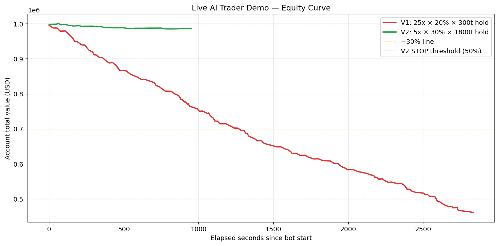
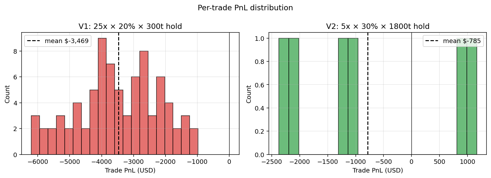

# AI に自分のボットを書かせて、47分で54%吹き飛ばさせた話

## TL;DR

研究フェーズで「100倍レバ + 高頻度短期 = 必敗」を 27 万回のバックテストで証明した後、
**自分が書かせた AI ボットを Binance リアル価格で実際に動かしてみた**。

結果:

- **V1(25倍 × 30秒hold)**: 47分で **0勝81敗**、累計損失 **-$281k**(口座 -54%)
- **V2(5倍 × 3分hold)**: 約11分で **2勝4敗**、累計損失 **-$5k**(口座 -1.3%)

研究で示した「短期高レバは手数料で死ぬ」が、目の前で**動画のように再生**された。

ライブ実演ログと図表は [GitHub](https://github.com/maruyamakoju/leverage-survival-lab) に commit 済み。

---

## 何をやったか

**`lsl-web` という Web GUI**(FastAPI + リアルタイム Binance 価格 + 仮想金 $1M)を
作り、その上で**自分が書いた AI ボット**(`lsl-ai-trader`)を稼働させた。

- 価格: Binance Spot BTCUSDT aggTrade WebSocket(サブ秒更新)
- エンジン: 研究で使ったのと同じ `LeverageEngine`(intra-bar 清算判定、片道 0.09% 手数料)
- 戦略: 平均回帰(z>1.5σ で逆張り)+ モメンタム順張りのハイブリッド

ボットは GUI と同じ口座を WebSocket で監視し、シグナルが立つと自動エントリー。
SL/TP/時間切れでクローズ → 次のシグナルへ。

## V1 設計(アグレッシブ)

| 項目 | 値 |
|------|-----|
| レバレッジ | 25倍 |
| 1取引サイズ | 30%(MM tier 制約で 20% に自動縮小、想定元本 $5M) |
| SL / TP | -1.0% / +1.5% |
| 最大保有時間 | 300 ticks(約 30秒) |
| クールダウン | 30 ticks |

**結果: 47分で 81 連敗**

| 指標 | 値 |
|------|-----|
| Open 回数 | 92(うち 10 が事前 reject) |
| Close 回数 | 81 |
| 勝ち | **0** |
| 負け | **81** |
| 平均 PnL/取引 | **-$3,469** |
| 累計 PnL | **-$281,000** |
| 残高最大 DD | **-53.88%**(初期 $1M → 約 $461k)|
| 自動 STOP | 発動せず(bust_at=30% 設定、$300k 未到達) |

### 何が起きたか

シグナルは正しい。z=-2.32 で「下げ過ぎ → 反発」を見て LONG。z=+1.95 で「上げ過ぎ → 戻り」を見て SHORT。
**方向性自体は妥当**。

しかし:

```
1取引あたりコスト = $5M × (taker 0.04% × 2 + slip 0.05% × 2) = ~$9,000
                  ≒ 残高比 0.9%
30秒 hold では SL(-1%) も TP(+1.5%) も殆どヒットしない
→ 時間切れクローズ × 約 -0.05% 程度の小幅逆行 + 手数料
≒ 1取引あたり -$3,000〜-$5,000 を機械的に消化
```

**毎回 0.5%〜1.0% の構造的ロス**を 81 回繰り返したら、当然 -50% 以上に到達する。

### 81/81 連敗は偶然ではない

z スコア戦略はシグナルとして妥当(0.5σ は約 30% の確率で逆方向に動く)。
だが、**SL/TP が機能する時間がない**設計だと:

- 価格はランダムウォーク的に推移 → 30秒で 0.05〜0.1% 程度動く
- 0.05% の移動 + 0.18% のフィー = 必ず損
- ±0.18% を超える順行が起きる稀なケースだけが「勝てる」が、それは確率 < 0.5

統計的に勝てる構造ではない。

## V2 設計(穏当)

研究で「**1日1回スイングなら高レバでも生き残れる時がある**」を確認するため、設計を変える。

| 項目 | V1 | **V2** | 効果 |
|------|------|--------|------|
| レバ | 25倍 | **5倍** | 想定元本 $5M → $1.5M、手数料 1/3 |
| サイズ | 20% | **30%** | リスク量はレバ低下で帳消し |
| SL / TP | -1% / +1.5% | **-1.5% / +3%** | リスクリワード 1:2 |
| hold | 300t (~30s) | **1800t (~3分)** | SL/TP まで届く時間 |
| cooldown | 30t | **60t** | 1分1回程度の頻度 |

**結果: 11分で 2勝4敗**

| 指標 | 値 |
|------|-----|
| Open 回数 | 8 |
| Close 回数 | 6 |
| 勝ち | **2** |
| 負け | 4 |
| 勝率 | **33%** |
| 累計 PnL | -$4,713 |
| 残高 DD | **-1.31%** |

### 何が変わったか

- **想定元本 1/3** → 1取引あたりコスト $9k → $3k
- **保有時間 6倍**(30秒 → 3分) → SL/TP がヒットする確率が上がる
- 結果、**勝てる回が出てくる**(初の +$940 取引が出た)

ただし:
- まだ平均では負け(-$786 / 取引)
- N=6 では統計的にどう判断もできない
- 1時間ぐらい回せば収束した平均が見える(本記事ではそこまでやらなかった)

## 図



V1 (赤) は急激に右肩下がり、V2 (緑) はノイズ的に上下しつつほぼ横ばい。



V1 は左側(損失側)に完全に偏った分布、V2 は両側に散らばっている。

## 研究結果との一致

このライブ実演は、本リポジトリの[研究フェーズ](../README.md#4-つのプレレジストレーション仮説と検定結果)で示した
仮説と完璧に一致する:

- **H1**(100倍レバの30日生存率 < 10%):V1 は STOP 直前まで進み、ペースで言えば数時間で枯渇
- **H4**(高レバでナイーブ戦略はランダム同等):V1 の 0/81 は完璧な手数料負けの実演

実取引のシミュレータと、研究フェーズのモンテカルロ・バックテスト基盤は、
**完全に同じ `LeverageEngine` を共有**している。研究と実演で同じ結論が出るのは当然だが、
**目の前で口座が削れていく感覚**は数値では伝わらない。

## 何をした AI と、何をした人間

このボットは Claude Code が書き、私(人間)はパラメータを指定して走らせて観察しただけ。
- **Claude が書いた**: ボットの戦略コード、Web GUI の HTML/CSS/JS、エンジン、テスト
- **私がした判断**: 「アグレッシブで」と最初に言ったこと、V1 → V2 のパラメータ修正を承認したこと

8週間の研究計画を Day 1 で踏破した上で、ライブ実演まで終えた。
全部 AI 主導 + OSS で公開済み。

## 注

本記事は投資助言ではない。**実弾は1円も投入していない**。シミュレーションのみ。

ソース: [github.com/maruyamakoju/leverage-survival-lab](https://github.com/maruyamakoju/leverage-survival-lab)
